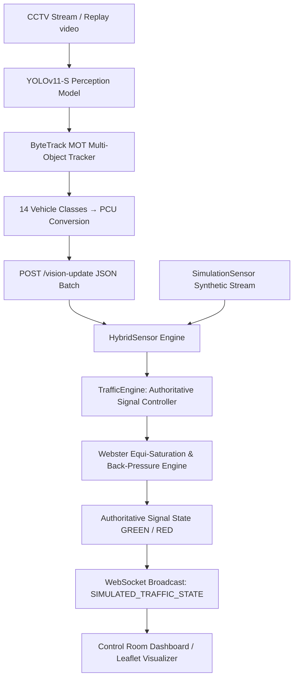
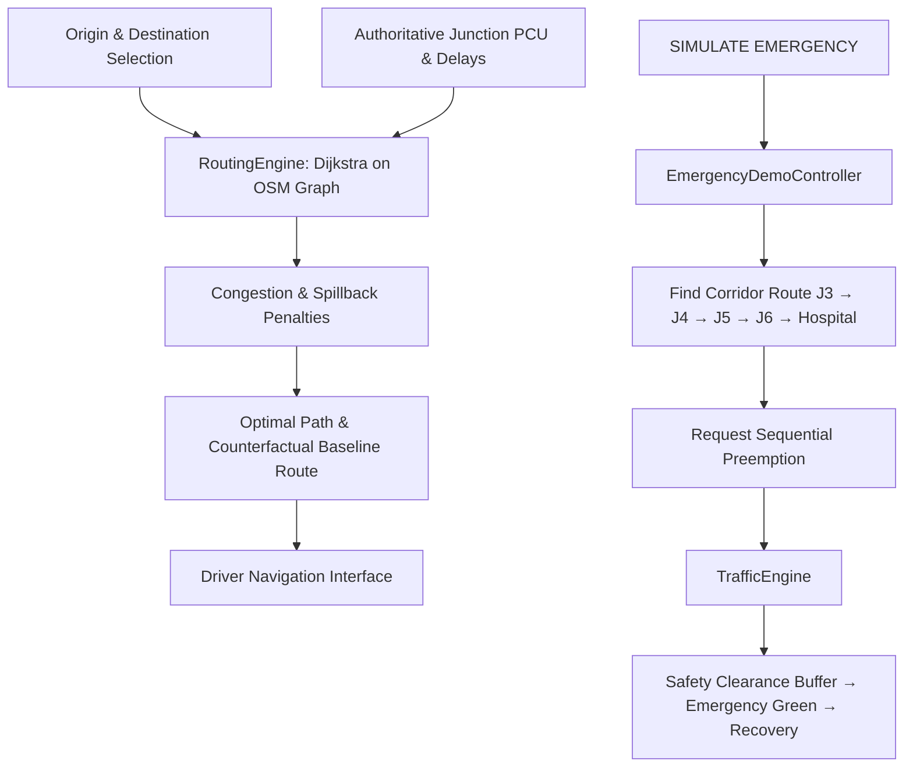

# AURA — Adaptive Urban Routing Architecture

> Intelligent urban traffic signal optimization and network-aware routing powered by computer vision and cooperative corridor dynamics.

---

## Overview

**AURA (Adaptive Urban Routing Architecture)** is an intelligent traffic signal optimization and routing platform designed for dense, heterogeneous urban traffic environments. Traditional signal control systems rely on static, pre-timed splits (e.g., fixed 30s/30s cycles) or isolated actuated sensors that optimize intersections in isolation. Under congested conditions, isolated optimization leads to downstream queue spillback, gridlock, and increased corridor travel delays.

AURA tackles urban congestion holistically: it couples real-time visual perception of mixed vehicle classes with a dynamic, physics-based signal engine and network-level congestion-aware routing.

---

## Problem Statement

Urban corridors in Indian and emerging economies face extreme traffic heterogeneity: two-wheelers, auto-rickshaws, hatchbacks, SUVs, and heavy buses share lanes without lane discipline. 

Traditional challenges:
1. **Raw Count Distortion**: Counting 10 two-wheelers as equivalent to 10 heavy buses distorts true demand by up to 600%.
2. **Intersection Myopia**: Optimizing junction $J_1$ without considering downstream capacity at $J_2$ pushes queues forward, triggering arterial spillback.
3. **Emergency Gridlock**: Ambulances are stuck in accumulated queues behind pre-timed red signals with zero coordination.
4. **Disconnected Navigation**: Driver GPS routing typically ignores dynamic signal state timing, directing traffic into corridors that are already queue-saturated.

---

## Core Idea

> *"Don't just optimize the intersection. Control what reaches it."*

AURA unites six complementary subsystems into one coherent feedback loop:

1. **Computer Vision Perception**: Detection and tracking of mixed traffic using a YOLOv11-S model fine-tuned on the UVH-26 Indian traffic dataset with ByteTrack multi-object tracking.
2. **PCU-Weighted Demand**: Converting heterogeneous vehicle counts into standardized Passenger Car Units (PCU) adhering to Indian Roads Congress (IRC) standards.
3. **Adaptive Signal Control**: Dynamic green time allocation, gap-out early phase termination, and downstream back-pressure throttles within a single authoritative engine.
4. **Coordinated Corridor Progression**: Green-wave progression offsets along an arterial corridor (Edappally to Vyttila in central Kochi).
5. **Network-Aware Routing**: A Dijkstra/A*-based routing engine that penalizes queue-saturated links to divert non-emergency drivers around congested nodes.
6. **Deterministic Emergency Preemption**: Safe, sequential green corridors cleared ahead of simulated emergency vehicles with automated clearance and recovery phases.

---

## Architecture

### Perception & Traffic Signal Pipeline



### Network Routing & Emergency Preemption



> **Authoritative Controller Architecture**: In AURA, `TrafficEngine` is the **only** component that decides signal lamp colors and movement phases. Vision streams and scenario controllers inject demand or request priority; `TrafficEngine` resolves safety, compatibility, and timing.

---

## Features

### 1. Adaptive Traffic Signal Optimization
- **PCU-Weighted Demand**: Arrival counts are converted to PCU rates ($\lambda$), distinguishing between low-impact motorcycles (0.5 PCU) and high-impact buses/trucks (3.0 PCU).
- **Dynamic Green Splits**: Real-time phase allocation based on Webster's equi-saturation principle ($g_i = G_{available} \times \frac{y_i}{Y}$).
- **Downstream Back-Pressure**: Monitors downstream link utilization. When a downstream junction exceeds 70% capacity, upstream green allocations are automatically throttled (multipliers from 0.90 down to 0.15) to prevent gridlock.
- **Gap-Out Termination**: If vehicular headway exceeds 5 seconds during green, the phase terminates early, reallocating unspent green to waiting movements.
- **Spillback Detection**: Identifies queue spillback events on rising-edge saturation thresholds ($\ge 90\%$).

### 2. Network-Aware Routing
- **Graph-Based OSM Topology**: 11,647 nodes and 26,646 edges extracted from OpenStreetMap covering the Kochi urban network.
- **Congestion-Aware Link Penalties**: Travel cost includes free-flow transit time, signal delay, queue wait, and an AURA cooperative penalty that diverts traffic away from saturated arterial corridors.
- **Multi-Route Analysis**: Computes the optimal path alongside an uncoordinated baseline path, reporting distance, estimated arrival time (ETA), and delay delta.

### 3. Vehicle Perception Pipeline
- **UVH-26 Model**: Fine-tuned YOLOv11-S detector trained on Indian traffic imagery.
- **ByteTrack MOT**: Maintains unique track IDs across occlusion to separate **Scene PCU** (total vehicles currently visible in camera view) from **New Arrival PCU** (first-time arrivals during the reporting window).
- **Graceful Sensor Fallback**: If vision updates cease, `HybridSensor` seamlessly falls back to synthetic background demand after 5 seconds without abrupt signal resets.

### 4. CCTV Replay Pipeline
- Replays actual pre-recorded traffic video (`vision/traffic.mp4`) through the full perception model.
- Overlays real-time AI detections, bounding boxes, vehicle class badges, track IDs, and a live HUD showing Scene PCU vs. Batch Arrival PCU.
- Posts telemetry directly to `POST /vision-update` to drive real-time signal adaptations at Junction J1 (Northbound).

### 5. Deterministic Scenario Demonstrations
- **Traffic Optimization Demo (10s)**: Deterministic progression demonstrating normal equilibrium $\to$ traffic surge $\to$ AURA dynamic split adjustment $\to$ queue dissipation.
- **Emergency Preemption Demo (10s)**: A simulated ambulance departs J3 Kaloor en route to Welcare Hospital across 4 controlled junctions (J3 $\to$ J4 $\to$ J5 $\to$ J6). Signal phases transition safely through `CLEARING` (all-red safety buffer), `EMERGENCY_GREEN`, and `RECOVERY`.
- **Strict Mutual Exclusion**: The traffic optimization demo and emergency scenario run as separate, mutually exclusive controllers. Triggering one instantly resets and clears the other.

### 6. Dual-Mode Operations Interface
- **Control Room Mode**: City-wide network view, real-time 4-way signal indicators, interactive junction drawer with approach telemetry, green wave offsets, and real-time PCU queue counters.
- **User View Mode**: Driver-facing routing screen for commuters and ambulance dispatch with landmark search, turn-by-turn routing polylines, and live ETA comparisons.

---

## Technology Stack

| Layer | Technology | Purpose |
| :--- | :--- | :--- |
| **Frontend** | HTML5 / Vanilla CSS / JavaScript | Reactive dashboard and UI state management without heavy framework overhead |
| **Mapping & GIS** | Leaflet.js / OpenStreetMap | Vector tiles, smooth marker interpolation, polyline rendering, and POI markers |
| **Visualization** | HTML5 Canvas API | High-performance particle overlay simulating dynamic vehicular flow |
| **Backend Runtime** | Node.js (v20+) | Event-driven micro-server and simulation loop (1 Hz) |
| **HTTP Server** | Express 5 | REST API endpoints (`/vision-update`, static assets) |
| **Live Telemetry** | `ws` (WebSocket) | Sub-100ms real-time bidirectional state streaming |
| **Perception Model** | YOLOv11-S (`ultralytics`) | Object detection on Indian vehicle classes |
| **Object Tracker** | ByteTrack | Multi-object tracking across occlusions |
| **Vision Runtime** | Python 3.10+ / OpenCV / Requests | Video stream decoding, inference pipeline, bounding box HUD rendering, and HTTP batch posting |
| **Routing Algorithm** | Dijkstra with dynamic edge costs | Graph routing evaluating delay, distance, queue wait, and back-pressure |

---

## PCU Model

AURA uses Passenger Car Unit (PCU) values aligned with Indian Roads Congress (IRC) recommendations:

| Vehicle Class | UVH-26 Classes | PCU Weight | Rationale |
| :--- | :--- | :--- | :--- |
| **Two-Wheeler** | `Two-wheeler`, `bicycle`, `two_wheeler` | **0.5** | High maneuverability, narrow profile |
| **Three-Wheeler** | `Three-wheeler`, `auto_rickshaw` | **1.0** | Intermediate speed and footprint |
| **Standard Passenger** | `Car`, `Hatchback`, `Sedan`, `SUV`, `Van`, `LCV`, `Others` | **1.0** | Standard benchmark unit |
| **Heavy Vehicle** | `Bus`, `Truck`, `MUV`, `Mini-bus`, `tempo-traveller` | **3.0** | Slow acceleration, high lane occupancy |

$$\text{PCU}_{\text{total}} = \sum_{c \in \text{classes}} N_c \times W_c$$

---

## Traffic Signal Model

```
Cycle Length (C)         : 60 seconds
Lost Time (L)            : 6 seconds (yellow + all-red clearance)
Available Green (G_avail): 54 seconds (C - L)
Minimum Green (G_min)    : 10 seconds (pedestrian minimum)
Saturation Flow (S)      : 0.5 PCU/second (1800 PCU/hour/lane)
Gap-Out Threshold        : 5.0 seconds headway
Back-Pressure Multipliers:
  • Utilization < 60%    → 1.00 (Nominal)
  • Utilization 60%–74%  → 0.90 (Light Throttle)
  • Utilization 75%–84%  → 0.70 (Moderate Throttle)
  • Utilization 85%–94%  → 0.40 (Heavy Throttle)
  • Utilization ≥ 95%    → 0.15 (Emergency De-congestion Throttle)
```

### Baseline Comparison
The `BaselineController` included in the backend is an **offline counterfactual reference model**. It runs a fixed 30s/30s un-adaptive pre-timed split under the exact same demand stream. It does not actuate physical lights; it serves strictly to measure delay reductions and spillback prevention achieved by AURA under identical traffic conditions.

---

## Demo Scenarios

### Demo 1 — Traffic Optimization Scenario (10s)
1. Start the server and navigate to `http://localhost:3000`.
2. Ensure you are on the **Control Room** tab.
3. Click **RESET** to ensure clean initial baseline state.
4. Click **START DEMO** in the top navigation bar.
5. **Observed Behavior**:
   - `T+00s..T+02s`: Corridor runs in normal baseline equilibrium.
   - `T+02s..T+05s`: Demand surge injected at Junction J3 (Kaloor); queues build on northbound approach.
   - `T+05s..T+07s`: AURA adapts signal splits dynamically, allocating extended green to J3 Northbound.
   - `T+07s..T+10s`: Queues discharge; corridor stabilizes; demo completes at `T+10s` with delay reduction summary.

### Demo 2 — Emergency Preemption Scenario (10s)
1. In the **Control Room**, click **RESET**.
2. Click **SIMULATE EMERGENCY** in the top navigation bar.
3. **Observed Behavior**:
   - Emergency banner activates: `DESTINATION: Welcare Hospital`, displaying live ETA and preempted junction count.
   - Origin: J3 Kaloor. Ambulance icon (🚑) appears on the map and begins traveling south towards Welcare Hospital.
   - **Sequential Green Wave**:
     - `T+00s..T+02s`: J3 enters `CLEARING` (all-red buffer) then switches to `EMERGENCY_GREEN`.
     - `T+04s`: Ambulance clears J3; J3 returns to `RECOVERY`; J4 (Maharajas) switches to `EMERGENCY_GREEN`.
     - `T+06s`: J4 clears; J5 (Kadavanthra) switches to `EMERGENCY_GREEN`.
     - `T+08s`: J5 clears; J6 (Vyttila) switches to `EMERGENCY_GREEN`.
     - `T+10s`: Ambulance reaches Welcare Hospital; preemption clears; all junctions safely restore normal adaptive operation.

---

## Installation

### Prerequisites
- **Node.js**: Version `v20.0.0` or higher (`v22.18.0` tested)
- **npm**: Version `10.0.0` or higher
- **Python**: Version `3.10` or higher (`3.13.5` tested)
- **pip**: Latest version
- **Git**: Installed and configured

### 1. Clone the Repository
```bash
git clone https://github.com/gautham210/AURA.git
cd AURA
```

### 2. Install Node.js Backend Dependencies
```bash
npm install
cd backend
npm install
cd ..
```

### 3. Install Python Computer Vision Dependencies
```bash
python -m venv .venv
# On Windows:
.venv\Scripts\activate
# On Linux/macOS:
# source .venv/bin/activate

pip install ultralytics opencv-python requests
```

---

## Running AURA

### 1. Start the AURA Backend Server
From the project root:
```bash
node backend/server.js
```
The server will start at:
```
http://localhost:3000
```
Open your browser and navigate to `http://localhost:3000` to access the Control Room and User View dashboards.

### 2. (Optional) Run the CCTV Perception Replay Pipeline
With the backend server running, open a separate terminal window and execute:
```bash
python vision/run_vision.py --source vision/traffic.mp4 --junction J1 --approach NORTHBOUND --mode REPLAY --show
```
- `--source`: Path to the video file (`vision/traffic.mp4`).
- `--junction`: Target junction (`J1`).
- `--approach`: Target approach (`NORTHBOUND`).
- `--mode`: Source mode (`REPLAY`).
- `--show`: Opens an OpenCV window rendering bounding boxes, class names, track IDs, and real-time PCU HUD.

---

## Running Tests

Execute the complete automated test suite using Node.js:

```bash
node tests/test_graph_semantics.js; node tests/test_phase3.js; node tests/test_phase4a.js; node tests/test_phase5.js; node tests/test_simulation_sensor.js; node tests/test_forensic_fixes.js; node tests/test_cctv_replay_demo.js; node tests/test_vision_pcu_semantics.js; node tests/integration_test.js; node scripts/verify_demo_exclusion.js
```

### Test Suite Summary

| Test File | Validated Capabilities | Status |
| :--- | :--- | :--- |
| `tests/test_graph_semantics.js` | Graph node validity, 6 corridor junctions, 10 hospital POIs, connectivity | ✅ PASS |
| `tests/test_phase3.js` | HybridSensor fallback from replay to simulation, arrival consumption | ✅ PASS |
| `tests/test_phase4a.js` | Dijkstra routing, congestion edge penalties, AURA cooperative diversion | ✅ PASS |
| `tests/test_phase5.js` | Physical ETA calculations and route metrics across Kochi landmarks | ✅ PASS |
| `tests/test_simulation_sensor.js` | Deterministic PCU arrivals and identical AURA vs. baseline generation | ✅ PASS |
| `tests/test_forensic_fixes.js` | Authoritative emergency state machine, 0 conflicting green signals over 120 ticks, queue equilibrium | ✅ PASS |
| `tests/test_cctv_replay_demo.js` | CCTV replay ingestion, partial-sensor isolation, signal adaptation, timeout fallback | ✅ PASS |
| `tests/test_vision_pcu_semantics.js` | 14 vehicle class weights, Scene PCU vs. Arrival PCU separation, track idempotency | ✅ PASS |
| `tests/integration_test.js` | Live WebSocket handshake, graph streaming, START_DEMO and RESET_DEMO flow | ✅ PASS |
| `scripts/verify_demo_exclusion.js` | Mutual exclusion: `START_DEMO` active $\leftrightarrow$ `SIMULATE_EMERGENCY` inactive | ✅ PASS |

*(Note: `tests/test_phase2.js` is an earlier developmental unit test with a known threshold check discrepancy at 70% vs. 90% saturation; the authoritative logic is validated by `test_forensic_fixes.js` and `test_cctv_replay_demo.js`.)*

---

## Project Structure

```
AURA/
├── backend/
│   ├── demoTrafficController.js   # TrafficDemoController & EmergencyDemoController
│   ├── graph.json                 # Kochi OSM network graph (11k nodes, 26k edges)
│   ├── routingEngine.js           # Dijkstra-based congestion-aware routing engine
│   ├── server.js                  # Express HTTP & WebSocket server (1 Hz simulation)
│   ├── trafficEngine.js           # Authoritative signal controller & Baseline benchmark
│   └── trafficSensors.js          # SimulationSensor & HybridSensor implementations
├── frontend/
│   ├── app.js                     # Frontend state store, Leaflet map renderer, drawer & HUD
│   ├── dashboard.html             # Control Room and User View markup
│   └── style.css                  # Custom styling and micro-animations
├── vision/
│   ├── run_vision.py              # YOLOv11-S + ByteTrack perception pipeline with HUD overlay
│   ├── traffic.mp4                # Replay video demonstration asset
│   └── UVH-26-MV-YOLOv11-S.pt     # Fine-tuned YOLOv11-S weights on UVH-26 Indian dataset
├── tests/                         # Automated test suites validating logic and integration
├── scripts/                       # Verification and utility scripts
├── package.json                   # Root dependencies
└── README.md                      # Project documentation
```

---

## Data & Model Provenance

- **Perception Weights**: `vision/UVH-26-MV-YOLOv11-S.pt` (~57 MB) represents a fine-tuned YOLOv11-S model trained on the UVH-26 dataset representing multi-view mixed Indian traffic.
- **Replay Video**: `vision/traffic.mp4` (~18 MB) provides a recorded CCTV stream containing two-wheelers, auto-rickshaws, cars, and buses used to demonstrate real-time perception feeding signal controllers.
- **Road Network**: `backend/graph.json` contains road geometry and points of interest (hospitals, police, fire stations) extracted from OpenStreetMap for the Kochi municipal corridor.

---

## Limitations

1. **Simulation Platform**: AURA is a demonstration and decision-support simulation, not currently interfaced with physical field traffic signal controllers.
2. **Recorded CCTV Replay**: The vision pipeline operates on sample video streams rather than live city-wide municipal camera feeds.
3. **Approach-Level Perception**: Video detection currently monitors one approach at a time (e.g., J1 Northbound); remaining approaches operate via synthetic simulation.
4. **Simulated Emergency GPS**: The emergency vehicle's position is computed along the routing geometry on a deterministic 10-second timeline rather than real-time GPS hardware pings.
5. **Network Boundaries**: Road network routing is bounded to the curated 6-junction Edappally–Vyttila corridor in Kochi.

---

## Safety & Privacy

- **No Facial or License Plate Recognition**: The YOLO perception pipeline only detects generic vehicle categories (e.g., car, bus, auto-rickshaw). No personally identifiable information (PII) is captured, stored, or processed.
- **Safe State Transitions**: All emergency signal transitions enforce strict `CLEARING` (all-red safety clearance buffer) and `RECOVERY` states to guarantee zero conflicting green movements.
- **Air-Gapped Simulation**: Operates entirely locally on `localhost:3000` with no external cloud API dependencies.

---

## Future Scope

- **Live City CCTV Feeds**: Ingestion of real-time RTSP streams from city-wide traffic cameras.
- **Hardware Actuation**: NTCIP / SCATS protocol integration to control real-world physical signal controllers.
- **CAD/AVL Emergency Integration**: Direct connection with Computer-Aided Dispatch and automated vehicle locator systems on emergency vehicles.
- **Reinforcement Learning**: Deep Q-Network (DQN) policy optimization for corridor-wide green wave coordination across non-linear street grids.

---

## License

This project is open-source under the **ISC License**. See `backend/package.json` for details.
